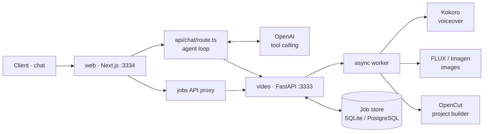

# AI Video Agent

An AI-powered video creation agent that turns a video idea into a finished OpenCut project through a chat interface.

## What it does

- Chat with an AI agent to describe the video you want.
- The agent writes and iterates on the script.
- Generate voiceover audio with Kokoro-82M.
- Generate scene images with local FLUX.1-schnell or cloud Imagen.
- Track long-running generation jobs with progress and durable status.
- Build an OpenCut project from the generated assets.
- Persist conversations and jobs with PostgreSQL in production or SQLite for local development.
- Authenticate users with Clerk.

## Architecture



## Repository structure

```text
agent-chat/
├── web/                 # Next.js application, chat UI and AI agent
│   └── src/app/api/
│       ├── chat/        # Agent/tool-calling endpoint
│       ├── conversations/
│       ├── jobs/
│       ├── artifacts/
│       └── health/
├── video/               # FastAPI connector and video-generation workers
│   ├── api/             # API, job store and worker
│   └── scripts/         # Voice, image and OpenCut generation
├── docs/                # Architecture, workflow and implementation docs
├── docker/              # Container definitions and compose setup
└── .github/workflows/   # CI/release automation
```

## Runtime flow

1. The user describes a video in the web chat.
2. The Next.js chat route sends the conversation to the OpenAI model.
3. The model selects tools such as `write_script`, voiceover, image generation and video building.
4. Synchronous work returns directly; expensive generation runs as an asynchronous job.
5. The UI polls job status and displays progress/results.
6. Completed assets are assembled into an OpenCut project.

## Services

| Service | Technology | Port | Responsibility |
| --- | --- | ---: | --- |
| Web | Next.js / React | 3334 | Chat UI, authentication, agent loop and API routes |
| Connector | FastAPI / Python | 3333 | Generation API, workers and job lifecycle |
| Database | SQLite / PostgreSQL | — | Jobs, conversations and messages |
| LLM | OpenAI-compatible API | — | Agent reasoning and tool selection |
| Voice | Kokoro-82M | — | Local voiceover generation |
| Images | FLUX.1-schnell / Imagen | — | Scene image generation |

## Local development

### Web

```bash
cd web
cp .env.example .env
pnpm install
pnpm dev
```

The web application runs on `http://localhost:3334`.

Required environment variables include:

- `OPENAI_API_KEY`
- `OPENAI_MODEL`
- `DATABASE_URL`
- `NEXT_PUBLIC_CLERK_PUBLISHABLE_KEY`
- `CLERK_SECRET_KEY`

See [`web/.env.example`](./web/.env.example) for the complete list.

### Video connector

```bash
cd video
./setup.sh
./run_api.sh
```

The connector runs on `http://localhost:3333`.

The connector can generate voice and images locally. Model weights are downloaded on first use. For tests, generation can use synthetic/mock fixtures without requiring the model runtime.

## API

The main connector operations are:

- `POST /script` — create a video script.
- `POST /voiceover` — queue voiceover generation.
- `POST /transcript` — queue transcript generation.
- `POST /images` — queue scene image generation.
- `POST /build` — build the OpenCut project.
- `GET /jobs/{id}` — inspect job status, progress and result.
- Job lifecycle endpoints support cancellation, resume, regeneration and artifact access.

The web application exposes the chat endpoint at `POST /api/chat` and proxies job operations for the browser.

## Testing

```bash
cd video
.venv-api/bin/pip install -r requirements-dev.txt
.venv-api/bin/python -m pytest
```

The test suite covers the job store, job lifecycle, progress/durability behavior, OpenCut project building and FastAPI endpoints using synthetic fixtures.

## Deployment

The project is designed as two cooperating services:

- Deploy `web/` as the Next.js application.
- Deploy `video/` as the FastAPI connector/worker.
- Configure `DATABASE_URL` to use PostgreSQL for shared production persistence.
- Keep secrets such as `OPENAI_API_KEY` and Clerk keys in the deployment environment rather than committing them.

See [`RUN.md`](./RUN.md) and [`docs/architecture`](./docs/architecture) for detailed setup, workflow and architecture documentation.
