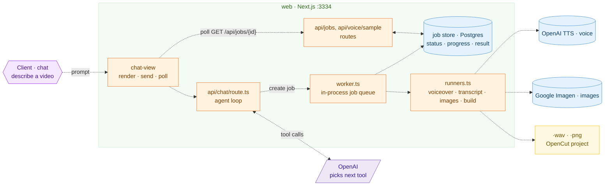

# AI Video Agent



An AI-powered video creation agent that turns a video idea into a finished OpenCut project through a chat interface — one Next.js service, no separate backend.

## What it does

- Chat with an AI agent to describe the video you want.
- The agent writes and iterates on the script.
- Generate voiceover audio with OpenAI TTS.
- Generate scene images with Google Imagen.
- Track long-running generation jobs with progress and durable status.
- Build an OpenCut project from the generated assets.
- Persist conversations and jobs with Neon Postgres.
- Authenticate users with Clerk.

## Repository structure

```text
agent-chat/
├── web/                 # Next.js application: chat UI, AI agent, job pipeline
│   └── src/
│       ├── app/api/
│       │   ├── chat/        # Agent/tool-calling endpoint
│       │   ├── conversations/
│       │   ├── jobs/        # Job status + artifacts (audio/images/project/srt/zip)
│       │   ├── artifacts/
│       │   ├── voice/sample/
│       │   └── health/
│       └── lib/jobs/        # Job store, worker, runners, OpenCut builder
├── docs/                # Architecture, workflow and implementation docs
├── docker/              # Container definition and compose setup
└── .github/workflows/   # CI/release automation
```

## Runtime flow

1. The user describes a video in the web chat.
2. The Next.js chat route sends the conversation to the OpenAI model.
3. The model selects tools such as `write_script`, voiceover, image generation and video building.
4. Synchronous work returns directly; expensive generation creates a job row and hands it to the in-process worker.
5. The UI polls job status and displays progress/results.
6. Completed assets are assembled into an OpenCut project.

## Services

| Service | Technology | Port | Responsibility |
| --- | --- | ---: | --- |
| Web | Next.js / React | 3334 | Chat UI, auth, agent loop, job pipeline and API routes |
| Database | Neon Postgres | — | Jobs, conversations and messages |
| LLM | OpenAI-compatible API | — | Agent reasoning and tool selection |
| Voice | OpenAI TTS | — | Narration generation (cloud) |
| Images | Google Imagen | — | Scene image generation (cloud) |

## Local development

```bash
cd web
cp .env.example .env
pnpm install
pnpm db:init      # applies web/src/lib/schema.sql to DATABASE_URL
pnpm dev
```

The application runs on `http://localhost:3334`.

Required environment variables include:

- `OPENAI_API_KEY` — chat model and TTS narration.
- `OPENAI_MODEL`, `OPENAI_TTS_MODEL` — optional overrides.
- `GEMINI_API_KEY` — required for image generation (Google Imagen).
- `DATABASE_URL`
- `NEXT_PUBLIC_CLERK_PUBLISHABLE_KEY`
- `CLERK_SECRET_KEY`

See [`web/.env.example`](./web/.env.example) for the complete list.

## API

The main job operations, all served by the Next.js app:

- `POST /api/chat` — the agent loop; `write_script`, voiceover, image generation and
  video building are all tool calls dispatched from here.
- `GET /api/jobs/{id}` — inspect job status, progress and result.
- Job lifecycle endpoints under `/api/jobs/{id}/...` support cancellation, resume,
  regeneration, subtitle edits and artifact access (script/audio/images/project/srt/zip).
- `GET /api/voice/sample` — cached TTS preview for a voice id.

## Testing

```bash
cd web
pnpm typecheck
pnpm build
```

No automated test suite yet for the job pipeline (`web/src/lib/jobs/*`) — see
[`RUN.md`](./RUN.md) for how it's currently verified.

## Deployment

The project is a single service:

- Deploy `web/` as the Next.js application (see [`docker/`](./docker) for a Dockerfile + compose setup).
- Configure `DATABASE_URL` (Neon Postgres) for conversations, messages and the job store.
- Mount a volume for job artifacts (`RUNS_DIR`, default `<cwd>/.data/runs`) so renders survive a restart.
- Keep secrets such as `OPENAI_API_KEY`, `GEMINI_API_KEY` and Clerk keys in the deployment environment rather than committing them.

See [`RUN.md`](./RUN.md) and [`docs/architecture`](./docs/architecture) for detailed setup, workflow and architecture documentation.
