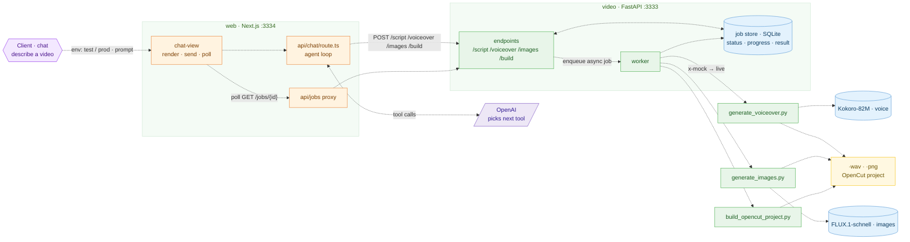

# AI Video Agent

```mermaid
flowchart LR
    U{{"Client · chat<br/>describe a video"}}

    subgraph WEB["web · Next.js :3334"]
        direction TB
        RT["api/chat/route.ts<br/>agent loop"]
        UI["chat-view<br/>render · send · poll"]
        PX["api/jobs proxy"]
    end

    LLM[/"OpenAI<br/>picks next tool"/]

    subgraph API["video · FastAPI :3333"]
        direction TB
        EP["endpoints<br/>/script /voiceover /images /build"]
        WK["worker"]
        JS[("job store · SQLite<br/>status · progress · result")]
    end

    VO["generate_voiceover.py"]
    IM["generate_images.py"]
    BD["build_opencut_project.py"]

    K[("Kokoro-82M · voice")]
    FX[("FLUX.1-schnell · images")]
    OUT["·wav · ·png<br/>OpenCut project"]

    U -. "env: test / prod · prompt" .-> UI
    UI -.-> RT
    RT <-. "tool calls" .-> LLM
    RT -. "POST /script /voiceover /images /build" .-> EP
    UI -. "poll GET /jobs/{id}" .-> PX -.-> EP
    EP -. "enqueue async job" .-> WK
    EP <-.-> JS
    WK -.-> JS
    WK -. "x-mock → live" .-> VO -.-> K
    WK -.-> IM -.-> FX
    WK -.-> BD
    VO -.-> OUT
    IM -.-> OUT
    BD -.-> OUT

    classDef client fill:#f3e8ff,stroke:#9333ea,color:#4a148c;
    classDef agent  fill:#fff3e0,stroke:#e8833a,color:#7a3e00;
    classDef llm    fill:#ede7f6,stroke:#7e57c2,color:#311b92;
    classDef svc    fill:#e8f5e9,stroke:#4caf50,color:#1b5e20;
    classDef store  fill:#e3f2fd,stroke:#5b9bd5,color:#0d3c61;
    classDef out    fill:#fff8e1,stroke:#f5c518,color:#6b5300;

    class U client;
    class RT,UI,PX agent;
    class LLM llm;
    class EP,WK,VO,IM,BD svc;
    class JS,K,FX store;
    class OUT out;

    style WEB fill:#f4fbf5,stroke:#cfe8d4,color:#33691e;
    style API fill:#f4fbf5,stroke:#cfe8d4,color:#33691e;
```
