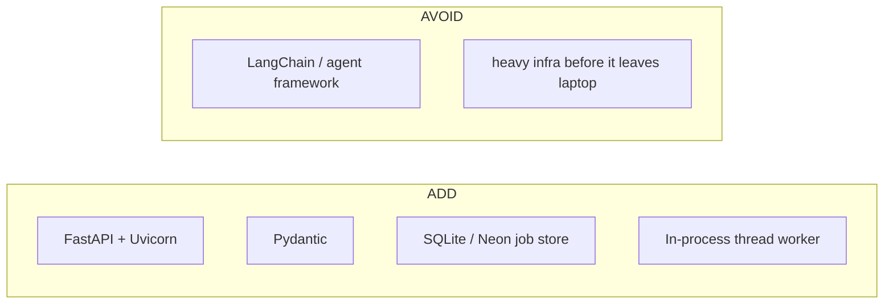

# 02 — Tech stack

[← TOC](./README.md)

## Layers

```
┌─ UI ─────────────────────────────────────────────┐
│ Next.js 16 · React 19 · Tailwind                 │
│ Clerk auth · conversation sidebar + Files drawer │
├─ Agent ──────────────────────────────────────────┤
│ OpenAI-compatible chat completions + tool calls  │
│ web/src/app/api/chat/route.ts                    │
│ (any provider via OPENAI_BASE_URL / OPENAI_MODEL)│
├─ Connector ──────────────────────────────────────┤
│ FastAPI (Python) + Uvicorn · Pydantic            │
│ video/api/: main · tasks · worker · jobs · models│
├─ Jobs ───────────────────────────────────────────┤
│ durable store: SQLite (jobs.db) or Neon Postgres │
│ in-process worker: 2 threads, GPU-serial images  │
├─ Models ─────────────────────────────────────────┤
│ Kokoro-82M (voice) · FLUX.1-schnell (local)      │
│ Google Imagen (cloud, GEMINI_API_KEY)            │
└──────────────────────────────────────────────────┘
```

## Add vs. avoid



Deliberately **not** used: a third-party agent framework (the tool loop is
hand-rolled in `route.ts`), a message broker (the in-process queue covers
the minutes tier; RQ/arq + Redis is the documented hours-tier swap, doc 06).

## Why FastAPI

```
lives in video/ venv ─ shells out to the scripts
auto OpenAPI docs    ─ free tool spec at /docs
Pydantic types       ─ mirror web/ TS types (models.py ↔ types.ts)
backend-native       ─ no AI-specific tooling
```

## Storage

```
web (conversations, messages)   Neon Postgres  — Clerk user_id scoped
video (job store)               SQLite jobs.db — or the SAME Neon DB when
                                DATABASE_URL is set (run_api.sh loads .env)
```

## Scale dial (one knob, set by job length)

```
minutes ───────────────────────────────────────► hours
in-process worker threads                     RQ/arq + Redis
SQLite / Neon job store (durable already)     unchanged
poll while open                               durable + notify
                        (see doc 06)
```
