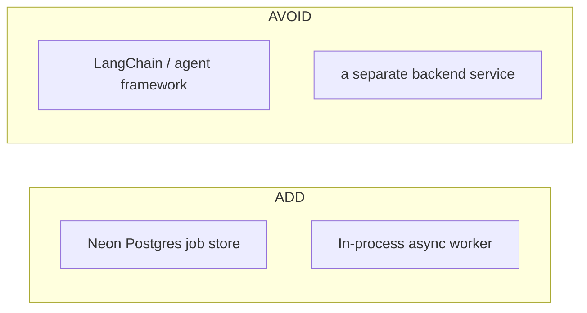

# 02 — Tech stack

[← TOC](./README.md)

## Layers

```
┌─ UI ─────────────────────────────────────────────┐
│ Next.js 16 · React 19 · Tailwind                 │
│ Clerk auth · conversation sidebar + Files drawer │
├─ Agent ──────────────────────────────────────────┤
│ OpenAI-compatible chat completions + tool calls  │
│ web/src/app/api/chat/route.ts                    │
│ (any provider via OPENAI_BASE_URL / OPENAI_MODEL)│
├─ Jobs ───────────────────────────────────────────┤
│ web/src/lib/jobs/: store · worker · runners       │
│ durable store: Neon Postgres (`jobs` table)      │
│ in-process worker: concurrency 2, same Node proc │
├─ Models ─────────────────────────────────────────┤
│ OpenAI TTS (voice, cloud)                        │
│ Google Imagen (images, cloud, GEMINI_API_KEY)    │
└──────────────────────────────────────────────────┘
```

## Add vs. avoid



Deliberately **not** used: a third-party agent framework (the tool loop is hand-rolled
in `route.ts`), a message broker (the in-process queue covers the minutes tier; a real
queue — BullMQ/Redis or similar — is the documented hours-tier swap, doc 06), and a
second service — every generation step is a cloud API call, so the job runners live in
the same Next.js process as the agent.

## Why one service

```
one Node process     ─ agent loop + job queue + runners, no inter-service hop
cloud-only models    ─ TTS and Imagen are plain HTTPS calls, no GPU/venv needed
shared types         ─ runner request types (lib/jobs/runners.ts) used directly
                        by the tool loop, no wire-format duplication
```

## Storage

```
conversations, messages   Neon Postgres — Clerk user_id scoped
job store (status/result) Neon Postgres — same DB, `jobs` table (schema.sql)
job artifacts (wav/png/…) local disk under RUNS_DIR (a mounted volume in Docker)
```

## Scale dial (one knob, set by job length)

```
minutes ───────────────────────────────────────► hours
in-process worker (lib/jobs/worker.ts)         real queue (BullMQ/Redis, etc.)
Neon job store (durable already)               unchanged
poll while open                                durable + notify
                        (see doc 06)
```
