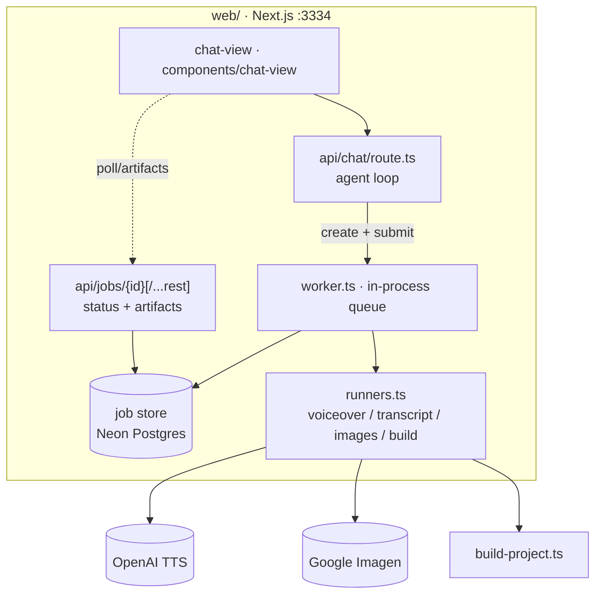

# 03 — Components

[← TOC](./README.md)

## Map



## Responsibilities

| Component | Role | Touches LLM? |
|-----------|------|:---:|
| `chat-view/` | render chat, send msg, job rows, poll live | ✗ |
| `route.ts` | agent loop — start/query tools | ✓ |
| `run-tool.ts` | dispatch a tool call: sync LLM helpers, or create+submit a job | ✗ |
| `api/jobs/{id}[/...rest]` | serve job status + artifacts from the store/run dir | ✗ |
| `worker.ts` | drain the job queue, run the matching runner, write result/error | ✗ |
| `runners.ts` | call OpenAI TTS / Google Imagen, write wav/png, build the project | ✗ |
| `store.ts` | durable status/progress/result (Postgres) | ✗ |

→ **Only `route.ts` talks to the LLM.** Everything else is plain backend, and it all
runs in the same Node process — `run-tool.ts` calls `worker.submit()` directly, no
network hop.

## Supporting web routes (web/src/app/api)

```
/chat                     agent loop (only LLM-touching route)
/jobs/{id}                job status (GET)
/jobs/{id}/[...rest]      artifacts + actions: audio, images, project, srt, file,
                          archive (GET) · cancel, resume, regenerate,
                          subtitles/delete (POST)
/artifacts                every job's run-dir files, for the Files drawer
/voice/sample             cached TTS preview clip for a voice id
/conversations            list / create / get / save / delete (Postgres, Clerk-scoped)
/health                   liveness probe
```

## Models (fixed inputs/outputs)

```
OpenAI TTS     script + voice(alloy|echo|fable|onyx|nova|shimmer) + speed ─▶ .wav
Google Imagen  prompts + (w,h)                                          ─▶ .png[] (cloud)
```

Voice list lives in `web/src/lib/jobs/tts.ts`; channel/art-style presets live in
`web/src/lib/channels.ts`.
