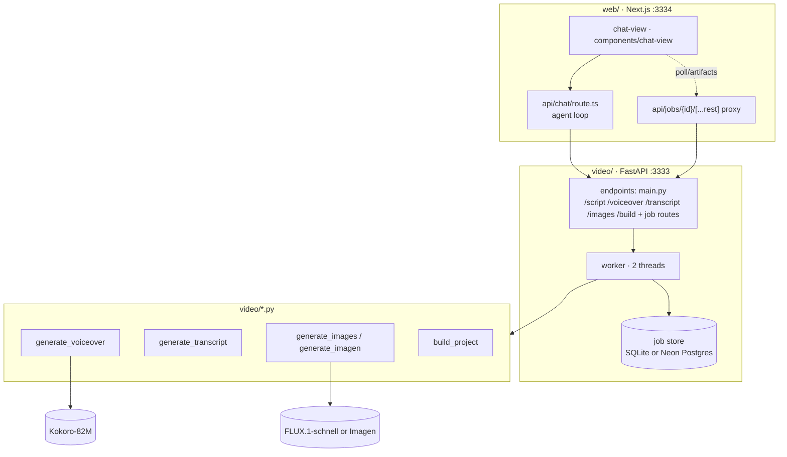

# 03 — Components

[← TOC](./README.md)

## Map



## Responsibilities

| Component | Role | Touches LLM? |
|-----------|------|:---:|
| `chat-view/` | render chat, send msg, job rows, poll live | ✗ |
| `route.ts` | agent loop — start/query tools | ✓ |
| `api/jobs/{id}/[...rest]` | proxy status + artifacts to FastAPI | ✗ |
| FastAPI endpoints | validate, enqueue job, return id | ✗ |
| worker | run scripts, write progress, cancel/resume | ✗ |
| job store | durable status/progress/result | ✗ |
| scripts + models | produce wav/png/transcript/opencut project | ✗ |

→ **Only `route.ts` talks to the LLM.** Everything else is plain backend.

## Connecting the two layers

The browser talks to the connector **directly** at `http://localhost:3333` (CORS
allows localhost + the hosted app; `connectorUrl()` in `lib/connector.ts`, override
with `?apiUrl=`). The `/api/jobs/{id}/[...rest]` proxy is only a same-origin fallback
when no base is configured.

## Supporting web routes (web/src/app/api)

```
/chat             agent loop (only LLM-touching route)
/jobs/{id}/[...rest]  same-origin fallback proxy → connector
/conversations    list / create / get / save / delete (Postgres, Clerk-scoped)
/health           connector reachability for the status pill
```

## Models (fixed inputs/outputs)

```
Kokoro-82M     script + voice(af_sky|bm_george|am_michael…) + speed ─▶ .wav
FLUX.1-schnell prompts + (w,h,steps)                                ─▶ .png[]
Google Imagen  prompts                                            ─▶ .png[] (cloud)
```

Voice list + channels/art-style presets live in `web/src/lib/channels.ts`.
