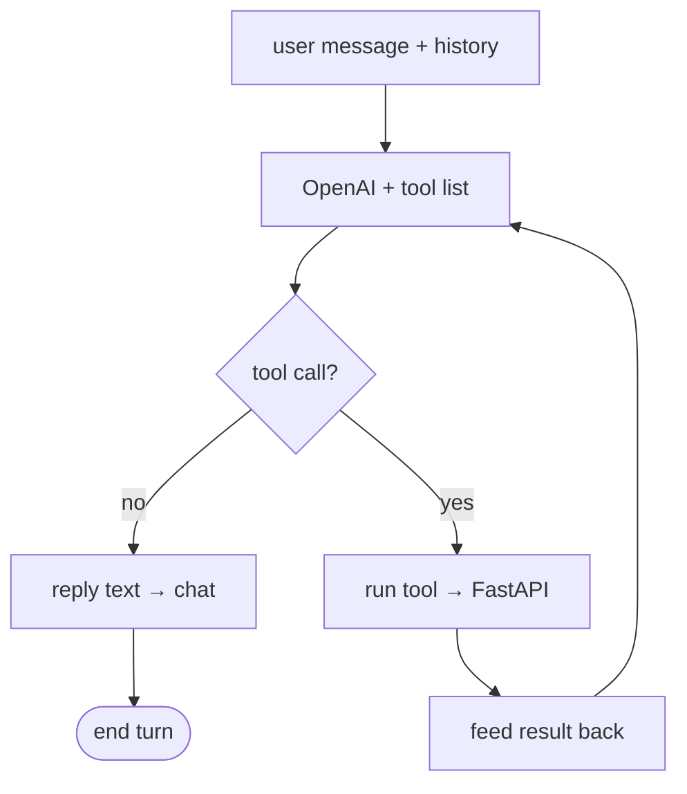

# 04 — Agent loop

[← TOC](./README.md)

## The cycle (lives in route.ts)



## Same loop, different tools

```
video agent (implemented)
─────────────────────────
write_script              (LLM drafts the script, grounded by channel)
generate_voiceover        (async job → Kokoro TTS wav)
generate_transcript       (async job → aligned transcript + wav)
generate_images           (async job → FLUX / Imagen pngs)
build_video               (async job → OpenCut project + srt)
get_job                   (status query, sync)
read_subtitles            (read a build's .srt, sync)
suggest_youtube_metadata  (title/desc/tags from the transcript, sync)
delete_subtitles          (remove captions from a finished build, sync)
```

All tool schemas live in `web/src/lib/chat/tools.ts`; execution in
`run-tool.ts`; the async-job endpoints are mapped in the same file.

## LLM never runs models

```
LLM  : "call generate_voiceover(script, voice='bm_george')"   ← decision only
code : POST :3333/voiceover  → worker → Kokoro                 ← execution
```

User says *"British documentary voice"* → LLM maps to `bm_george` enum value
you supplied in the tool schema. The voice list comes from
`video/api/models.py` (`Voice` literal), a curated subset of `video/README.md`.

Channel presets (`web/src/lib/channels.ts`) prepend a script voice (scriptDNA)
and append an art style (imageStyle) server-side in `run-tool.ts`, so every
video stays on-brand for its chosen niche.

## Two rhythms

```
LLM turns   ▏█▏    ▏█▏        ▏█▏      fast · costs tokens · decides
job polling   ····················     slow · free · watches models
              (no LLM involved)
```
