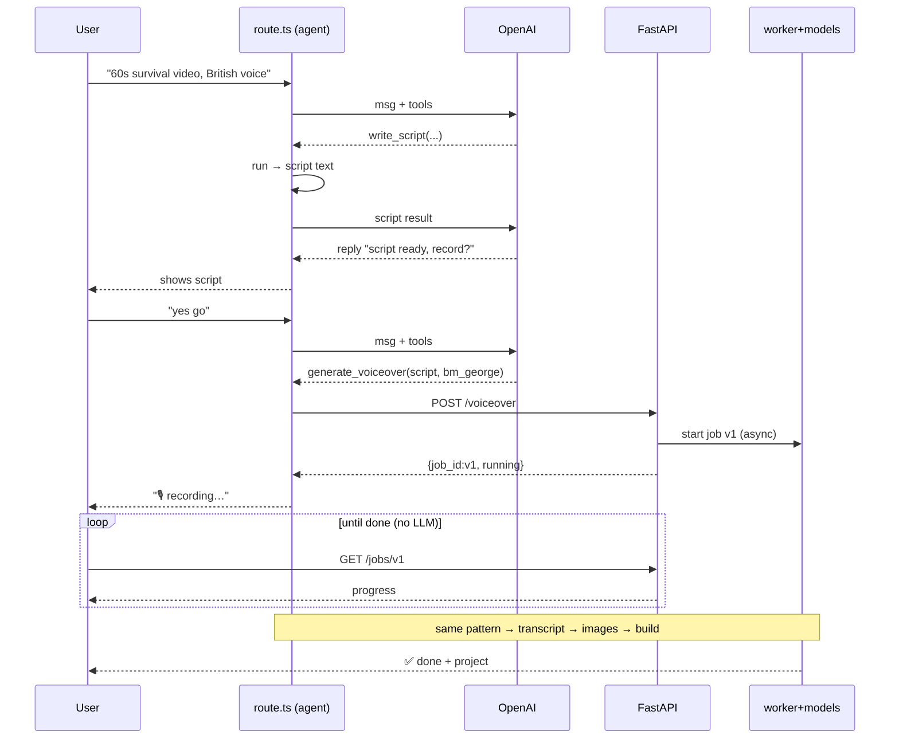

# 05 — Workflow

[← TOC](./README.md)

## End-to-end trace



> Polling (`GET /jobs/{id}`) hits the connector **directly** from the browser
> (doc 10 — localhost CORS), never the LLM. The transcript stage is usually
> started alongside voiceover (same script, same voice).

## Stage timeline

```
chat   │■ask        ■go                      ■watch          ■done
agent  │ █loop1  █loop2(start)   █loop3(start)   █loop4
OpenAI │ █       █                █                █          brain
FastAPI│         ██ /voiceover    ██ /images       ██ /build  async
models │         ███ Kokoro       ████████ FLUX     █ assemble slow
poll   │         ···· GET /jobs/{id} ····                     free
```

## Per-stage pattern (repeats)

```
LLM picks tool ─▶ FastAPI starts job ─▶ returns id ─▶ chat polls ─▶ done ─▶ next stage
```

→ Slow stages handled in [06 — Long jobs](./06-long-running-jobs.md).
