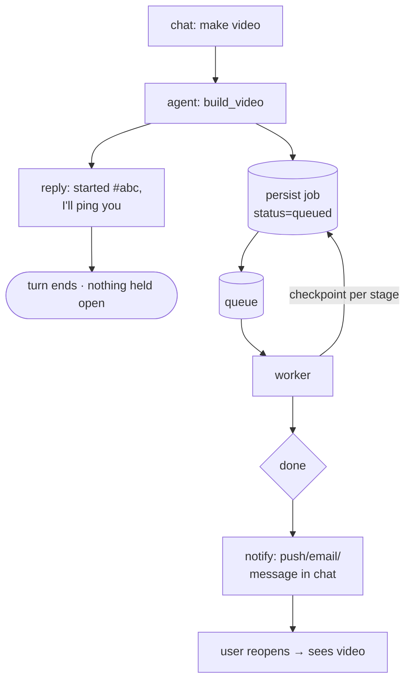

# 06 — Long-running jobs (the hours case)

[← TOC](./README.md)

## Where we are now

The minutes tier is **already durable** — the job store is SQLAlchemy over
SQLite (`video/jobs.db`) or Neon Postgres when `DATABASE_URL` is set
(`video/api/jobs.py`). A small in-process worker (2 threads, `worker.py`)
drains a queue; the heavy model scripts run as subprocesses so a crash of the
API doesn't take them down mid-render.

What's NOT durable yet:

```
assumption (ok at minutes)        fails because
─────────────────────────         ─────────────
in-process queue            ✗     API restart/sleep → queued/running jobs orphaned
browser polls till done     ✗     tab closes, wifi drops
agent waits for result      ✗     no turn waits hours
user watches                ✗     they've moved on → must notify
```

## What survives a restart today (doc 06 checkpointing)

```
on startup (api/main.py lifespan):
  reset_orphans()        → queued/running jobs are failed with
                           "worker restarted before this job finished"
  _reconcile_image_orphans() → an images job whose PNGs all made it to disk
                           is promoted back to "done" (on-disk checkpoint)

resume: POST /jobs/{id}/resume  → re-renders only the MISSING image indices
                                  (runs under the same job id, keeps progress)
```

The "skip PNGs already on disk" checkpoint pattern:

```
job abc:  voiceover ✓   transcript ✓   images 137/180   build —
                                              │
crash at hr5 ──▶ resume at frame 138 ─────────┘  (images/<index>_<MM-SS>.png)
```

## Shift: fire-and-forget + durable + notify



## Stack: minutes → hours

```
                 minutes (now)          6 hours
job store        SQLite / Neon  ──▶    unchanged (already durable)
worker           in-process threads ─▶ separate process (RQ / arq)
queue            thread-safe Queue ─▶  Redis (or SQLite-backed)
progress         poll while tab open ─▶ poll only while tab open
notify           tab is open  ──▶       push / email / chat message
pipeline         run straight  ──▶      checkpoint per stage
```

Single-user/local minimum for the hours tier: **same store + RQ/arq worker +
Redis**. The store and stage runners are unchanged; only the queue/process
boundary moves (`worker.py` comment).

## Chat experience

```
start   "🎬 started #abc — ~6h. close this, I'll let you know."
ask     "how's the video?" → get_job(abc) → "76% · 137/180 · ~1h20 left"
done    "✅ #abc finished — here's your video"  (+ email/push)
```

## Open decision

```
HOW does the user find out it's done?
  ( ) message dropped into the conversation
  ( ) email
  ( ) browser/web push
```
