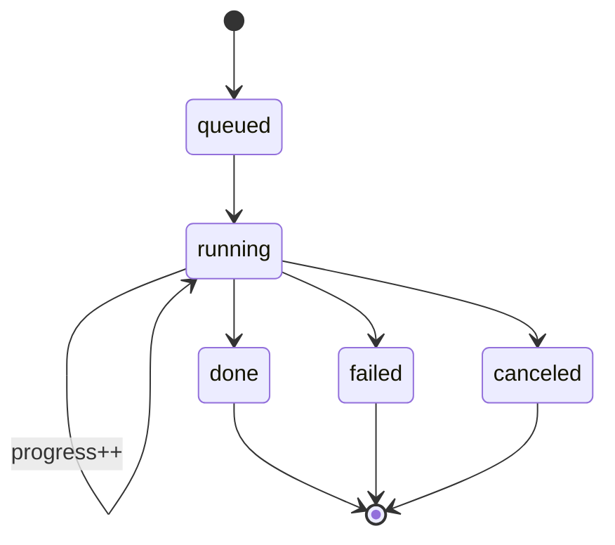

# 07 — API & tools

[← TOC](./README.md)

## FastAPI endpoints (video/ :3333 — api/main.py)

```
POST /script      {topic, duration}                       → {text}     (sync)
POST /voiceover   {script, voice, speed}                  → {job_id}   (async)
POST /transcript  {script, voice, speed}                  → {job_id}   (async)
POST /images      {prompts[], width, height, steps, provider} → {job_id} (async)
POST /build       {name, audio_file, transcript_file, images_dir, include_captions} → {job_id} (async)

GET  /jobs/{id}                            → {status, progress, result, error}
POST /jobs/{id}/cancel                     → stop a running job (kills subprocess)
POST /jobs/{id}/resume                     → finish a partially-rendered images job
POST /jobs/{id}/regenerate                 {index} → re-render one image (keeps old)
POST /jobs/{id}/subtitles/delete           {indices[]} → edit a finished build's captions

# artifact serving (Files drawer / previews)
GET  /jobs/{id}/script        GET  /jobs/{id}/transcript
GET  /jobs/{id}/audio         GET  /jobs/{id}/project        (.opencut.json)
GET  /jobs/{id}/srt           GET  /jobs/{id}/images         (list, with prompts)
GET  /jobs/{id}/images/{name} GET  /jobs/{id}/archive        (.zip)
GET  /jobs/{id}/file/{rel}    GET  /artifacts                (all jobs' files)

# misc
GET  /health                  GET  /voice/sample?voice=&speed=  (cached Kokoro preview)
```

Request/response models are Pydantic in `video/api/models.py` (mirror of
`web/src/lib/types.ts`).

## Job state machine



Orphaned `queued`/`running` jobs from a crash are marked `failed` on restart
(doc 06); a finished images job whose PNGs survived is recovered to `done`.

## /jobs/{id} response

```jsonc
{
  "id": "abc",
  "tool": "generate_images",
  "status": "running",      // queued|running|done|failed|canceled
  "progress": { "stage": "images", "current": 137, "total": 180 },
  "result": null,           // stage-dependent paths/urls when done
  "error": null
}
```

## Agent tool schemas (web/src/lib/chat/tools.ts)

```jsonc
write_script        { topic: string, duration: number }
generate_voiceover  { script: string, voice: "af_sky"|"bm_george"|"am_michael"|..., speed?: number }
generate_transcript { script: string, voice: ..., speed?: number }
generate_images     { prompts: string[], width?: 1024, height?: 576, steps?: 2 }
build_video         { project: { name?, audio_file?, transcript_file?, images_dir?, include_captions? } }
get_job             { job_id: string }
read_subtitles      { job_id: string }
suggest_youtube_metadata { transcript?: string, job_id?: string }
delete_subtitles    { job_id: string, indices: number[] }
```

`generate_images` and `build_video` are async: they return a `job_id` and the
chat renders a live job card (polls `GET /api/jobs/{id}` / the connector).

## Tool ↔ endpoint ↔ script ↔ model

```
write_script             → (LLM only, no endpoint)
generate_voiceover       → POST /voiceover  → generate_voiceover.py   → Kokoro-82M
generate_transcript      → POST /transcript → generate_transcript.py  → Kokoro-82M
generate_images          → POST /images     → generate_images.py      → FLUX.1-schnell
                                              (provider=imagen → generate_imagen.py → Google Imagen)
build_video              → POST /build      → api/build_project.py    → OpenCut project + srt
get_job                  → GET  /jobs/{id}  → job store
read_subtitles           → GET  /jobs/{id}/srt
suggest_youtube_metadata → (LLM only, reads the transcript via get_job/read_subtitles)
delete_subtitles         → POST /jobs/{id}/subtitles/delete
```

## Cost guardrails (enforced on BOTH layers)

```
MAX_VIDEO_DURATION_SECONDS (default 30)  → caps write_script target length
MAX_IMAGES_PER_VIDEO       (default 10)  → caps generate_images prompts
```

Web clamps before calling (`web/src/lib/config.ts`, `run-tool.ts`); the
connector re-checks as a hard backstop (`video/api/config.py` + models.py).
Also on the connector: `voice` must be in the allowed enum, `speed` 0.5–2.0,
`steps` 1–8.

## Swappable boundary

```
change model/host ──▶ edit endpoint internals only
agent tool schema  ──▶ unchanged
```
