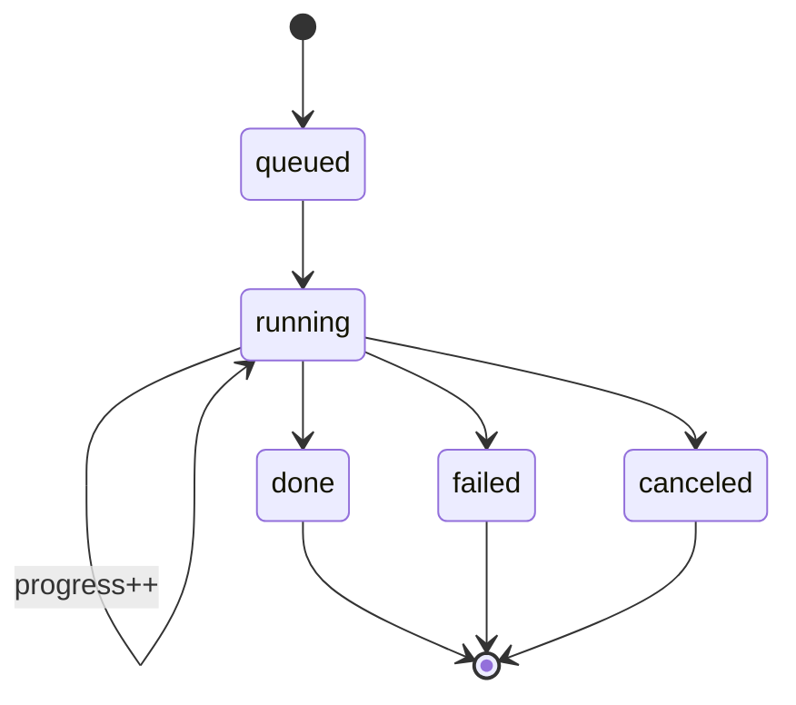

# 07 — API & tools

[← TOC](./README.md)

## Job creation (in-process — no HTTP)

`run-tool.ts` runs server-side inside `api/chat/route.ts`, so async tools create a job
row and hand it to the worker directly (`lib/jobs/store.ts` + `lib/jobs/worker.ts`) —
there's no `/voiceover`/`/images`/`/build` endpoint to POST to. Request shapes are the
TypeScript types in `lib/jobs/runners.ts` (`VoiceoverRequest`, `TranscriptRequest`,
`ImagesRequest`, `BuildRequest`), which mirror `web/src/lib/chat/tools.ts`'s tool
schemas.

## HTTP routes (web/src/app/api) — what the browser calls directly

```
GET  /jobs/{id}                            → {status, progress, result, error}
POST /jobs/{id}/cancel                     → stop a running job (aborts its fetch)
POST /jobs/{id}/resume                     → finish a partially-rendered images job
POST /jobs/{id}/regenerate                 {index} → re-render one image (keeps old)
POST /jobs/{id}/subtitles/delete           {indices[]} → edit a finished build's captions

# artifact serving (Files drawer / previews)
GET  /jobs/{id}/script        GET  /jobs/{id}/transcript
GET  /jobs/{id}/audio         GET  /jobs/{id}/project        (.opencut.json)
GET  /jobs/{id}/srt           GET  /jobs/{id}/images         (list, with prompts)
GET  /jobs/{id}/images/{name} GET  /jobs/{id}/archive        (.zip)
GET  /jobs/{id}/file/{rel}    GET  /artifacts                (all jobs' files)

# misc
GET  /health                  GET  /voice/sample?voice=&speed=  (cached TTS preview)
```

## Job state machine



Orphaned `queued`/`running` jobs from a crash are marked `failed` on startup (doc 06).

## /jobs/{id} response

```jsonc
{
  "id": "abc",
  "tool": "generate_images",
  "status": "running",      // queued|running|done|failed|canceled
  "progress": { "stage": "images", "current": 7, "total": 10 },
  "result": null,           // stage-dependent paths/urls when done
  "error": null
}
```

## Agent tool schemas (web/src/lib/chat/tools.ts)

```jsonc
write_script        { topic: string, duration: number }
generate_voiceover  { script: string, voice: "alloy"|"echo"|"fable"|"onyx"|"nova"|"shimmer", speed?: number }
generate_transcript { script: string, voice: ..., speed?: number }
generate_images     { prompts: string[], width?: 1024, height?: 576 }
build_video         { project: { name?, audio_file?, transcript_file?, images_dir?, include_captions? } }
get_job             { job_id: string }
read_subtitles      { job_id: string }
suggest_youtube_metadata { transcript?: string, job_id?: string }
delete_subtitles    { job_id: string, indices: number[] }
```

`generate_voiceover`, `generate_transcript`, `generate_images` and `build_video` are
async: they return a `job_id` and the chat renders a live job card (polls
`GET /api/jobs/{id}`).

## Tool ↔ runner ↔ model

```
write_script             → (LLM only, no job)
generate_voiceover       → runVoiceover  → OpenAI TTS
generate_transcript      → runTranscript → OpenAI TTS (per line) + wav concat
generate_images          → runImages     → Google Imagen
build_video              → runBuild      → build-project.ts → OpenCut project + srt
get_job                  → store.get(id)
read_subtitles           → GET  /jobs/{id}/srt
suggest_youtube_metadata → (LLM only, reads the transcript via get_job/read_subtitles)
delete_subtitles         → deleteCaptions() (build-project.ts)
```

## Cost guardrails

```
MAX_VIDEO_DURATION_SECONDS (default 30)  → caps write_script target length
MAX_IMAGES_PER_VIDEO       (default 10)  → caps generate_images prompts
```

The agent clamps before enqueueing (`web/src/lib/config.ts`, `run-tool.ts`) — there's
only one layer now, so this is the single source of truth.

## Swappable boundary

```
change model/host ──▶ edit the matching runner in lib/jobs/runners.ts only
agent tool schema  ──▶ unchanged
```
