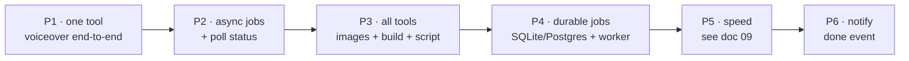

# 08 — Implementation phases (historical)

[← TOC](./README.md)

The build order the system shipped in. Everything through P4/P5 is **done**;
P6 (notify) remains the open item (doc 06).



## Phase status

```
P1  prove web↔video↔model                 ✅ done
    └ FastAPI POST /voiceover + route.ts tool generate_voiceover
P2  async pattern                          ✅ done
    └ return job_id + GET /jobs/{id} + live chat polling
P3  full pipeline                          ✅ done
    └ generate_images, build_video, write_script, get_job,
      generate_transcript, read_subtitles, suggest_youtube_metadata,
      delete_subtitles, cancel/resume/regenerate
P4  survive restarts                       ✅ done
    └ SQLAlchemy job store (SQLite / Neon) + in-process worker
      + orphan recovery + image resume (doc 06)
P5  performance                            ✅ done (within current caps)
    └ 10 images max · 4s spacing · 2 steps → minutes, not hours (doc 09)
P6  fire-and-forget UX                     ⬜ open
    └ notify on done (push/email/chat message)
```

## Definition of done per phase

| Phase | Done when | Status |
|-------|-----------|--------|
| P1 | chat → voiceover.wav appears | ✅ |
| P2 | chat shows live job progress | ✅ |
| P3 | chat produces a full .opencut project | ✅ |
| P4 | kill the worker mid-run → resumes | ✅ |
| P5 | image gen wall-time minutes, not hours | ✅ |
| P6 | close tab → get pinged on completion | ⬜ |
