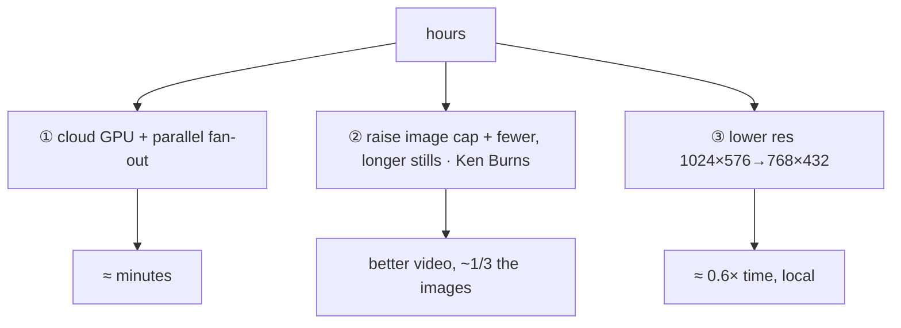
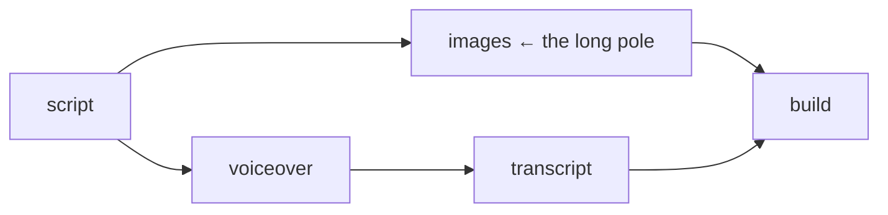

# 09 — Performance (image generation)

[← TOC](./README.md)

## The shape today

The cost guardrails keep a single video small, so wall-time is **minutes, not
hours**:

```
MAX_IMAGES_PER_VIDEO = 10        one image per prompt, spacing 4s (tasks.py)
FLUX.1-schnell · 1024×576 · 2 steps · 4-bit · Apple Silicon (MLX)
  ≈ a few seconds per image  +  5s GPU cooldown between images
  → a 10-image video ≈ 1–2 min of image gen
first run: weights (~a few GB) download once, then offline
```

That's the **local, free** path. On non-Apple-Silicon hosts (or for speed on
any host) the connector can route images to **Google Imagen** instead
(`provider=imagen` on POST /images, needs `GEMINI_API_KEY`) — a cloud call,
no GPU, no cooldown.

## Why local FLUX used to be slow (historical root cause)

```
M2 base = 8 GPU cores, 16GB         ← entry-level Apple Silicon
one GPU = strictly serial           ← no local parallelism possible
steps already 2 (schnell minimum)   ← nothing left to cut there
180-image scripts (pre-guardrail)   ← the real culprit: 6–7 h
```

## Levers if a video needs to get big again (biggest win first)



## ① Cloud fan-out — if you lift the 10-image cap

```
local M2: [img1][img2]...[img180]   serial
                  │
                  ▼
cloud:    [img1]┐
          [img2]├─ 16 concurrent workers  ┐
          [img3]┤   on H100/A100 ~1–2s ea ├─ wall ≈ minutes
           ...  ┘                         ┘
cost: schnell ≈ $0.003/img × 180 ≈ $0.50–1.00 per video
boundary: only the FastAPI /images endpoint changes; the agent tool
schema stays identical (doc 07). Today Imagen already gives the cloud
path without fan-out tooling.
```

## ② Fewer frames — free, also better (architectural)

```
180 unique stills ──▶ 40–60 stills + Ken Burns pan/zoom (motion on each in
                      the build step)
result: ~1/3 generation time AND more dynamic video
```

## ③ Local-only knobs (if staying offline)

```
resolution   1024×576 → 768×432    ~0.6× time (upscale later if needed)
steps        keep at 2             already minimal (schnell)
quantize     keep 4-bit            8-bit = slower + more memory
memory       close all apps        16GB is the squeeze; avoid swap
seed/batch   no local parallelism  one GPU = serial, period
hardware     M2 → M-Pro/Max/Ultra  more GPU cores = linear speedup
cooldown     VIDEO_IMAGE_COOLDOWN  0 disables the 5s idle between images
```

## Pipeline overlap (implemented)



The worker pool is 2 threads (`VIDEO_WORKERS`), so voiceover/transcript
overlap the long image job; image gen itself is GPU-serial. Build waits on
both.

## Recommendation

```
today:     keep local FLUX for free/offline default (10 images ≈ minutes)
big videos: either Imagen (cloud) or raise the cap + cloud fan-out (doc 07
           boundary: /images endpoint only)
motion:    Ken Burns on stills when videos must look more dynamic
```
