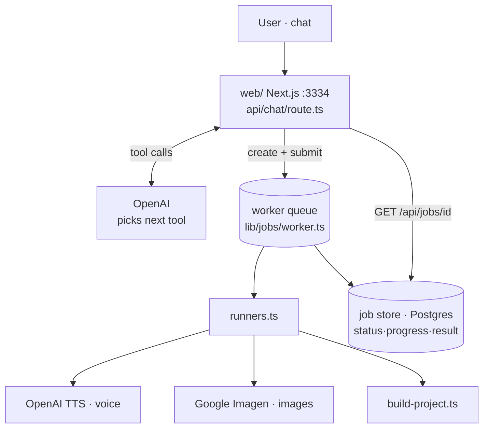

# AI Video Agent — Technical Architecture

Chat request → AI agent → finished video. The agent is a thin tool-calling loop;
everything else is an async job pipeline (`web/src/lib/jobs/`) that calls cloud
TTS/image APIs and assembles the OpenCut project — all in the same Next.js service.

## TOC

| #   | Doc                                     | Covers                    |
| --- | --------------------------------------- | ------------------------- |
| 01  | [Overview](./01-overview.md)            | Idea + what exists        |
| 02  | [Tech stack](./02-tech-stack.md)        | Layers, add vs. avoid     |
| 03  | [Components](./03-components.md)        | UI · agent · API · models |
| 04  | [Agent loop](./04-agent-loop.md)        | Tool-calling cycle        |
| 05  | [Workflow](./05-workflow.md)            | End-to-end trace          |
| 06  | [Long jobs](./06-long-running-jobs.md)  | Durable jobs (6h case)    |
| 07  | [API & tools](./07-api-and-tools.md)    | Endpoints + tool schemas  |
| 08  | [Phases](./08-implementation-phases.md) | Build order               |
| 09  | [Performance](./09-performance.md)      | Faster image gen (h → min) |
| 10  | [UI](./10-ui.md)                        | Chat front-end · job cards |

## System



## Responsibility split

```
LLM (OpenAI)      → decides next step          [done — route.ts]
Cloud models      → voice + images, per-call    [done — lib/jobs/]
YOU build         → tools + job pipeline        [100% backend]
```
